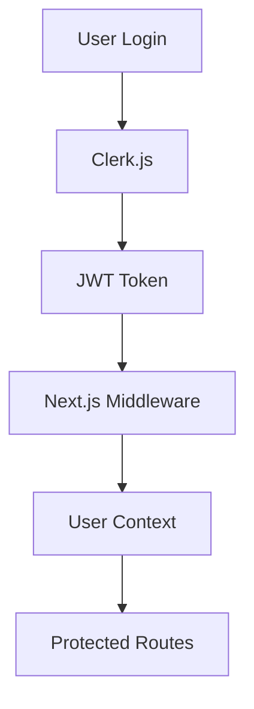

# 🏗️ Arquitetura do Sistema de Intranet ELO

## 📋 Visão Geral da Arquitetura

O Sistema de Intranet ELO é construído seguindo princípios de arquitetura moderna, com foco em escalabilidade, manutenibilidade e experiência do usuário. A arquitetura segue o padrão **Full-Stack TypeScript** com separação clara de responsabilidades.

## 🎯 Princípios Arquiteturais

### 🏛️ **Clean Architecture**
- **Separação de responsabilidades** entre camadas
- **Dependências sempre apontando para dentro** (inward pointing)
- **Interfaces claras** entre módulos
- **Testabilidade** em todas as camadas

### ⚡ **Performance First**
- **Server-Side Rendering** (SSR) para melhor SEO
- **Static Generation** onde possível
- **Code Splitting** inteligente
- **Optimistic Updates** para melhor UX

### 🔒 **Security by Design**
- **Type Safety** em toda aplicação
- **Input Validation** rigorosa
- **Authentication** granular
- **Authorization** baseada em roles

## 🏗️ Arquitetura em Camadas

### 📱 **1. Presentation Layer (Frontend)**

#### 🎨 **Framework & UI**
- **Next.js 14** - React Framework com App Router
- **React 18** - Interface reativa
- **TypeScript** - Type safety
- **Tailwind CSS** - Utility-first styling

#### 📦 **UI Components**
- **Radix UI** - Componentes primitivos acessíveis
- **shadcn/ui** - Design system consistente
- **Lucide React** - Iconografia unificada
- **React Hook Form** - Gerenciamento de formulários

#### 🔄 **State Management**
- **React Hooks** - State local
- **tRPC Cache** - Server state
- **Context API** - Global state
- **Optimistic Updates** - UX melhorada

### ⚙️ **2. Application Layer (API)**

#### 🌐 **tRPC - Type-Safe APIs**
```typescript
// Router Example
const appRouter = router({
  user: userRouter,
  room: roomRouter,
  food: foodRouter,
  suggestion: suggestionRouter
})

export type AppRouter = typeof appRouter
```

#### 🔧 **Middleware & Procedures**
```typescript
// Protected Procedure
const protectedProcedure = publicProcedure
  .use(authMiddleware)
  .use(rateLimitMiddleware)

// Admin Procedure
const adminProcedure = protectedProcedure
  .use(adminRoleMiddleware)
```

### 🗄️ **3. Domain Layer (Business Logic)**

#### 📊 **Prisma ORM**
```typescript
// Type-safe database operations
const user = await prisma.user.findUnique({
  where: { id: userId },
  include: {
    bookings: true,
    foodOrders: true,
    suggestions: true
  }
})
```

#### 🎯 **Business Rules**
- **Domain Services** - Lógica de negócio pura
- **Validators** - Regras de validação
- **Mappers** - Transformação de dados
- **Events** - Comunicação entre módulos

### 🏪 **4. Infrastructure Layer**

#### 💾 **Database**
- **PostgreSQL** - RDBMS principal
- **Prisma** - ORM e migrações
- **Connection Pooling** - Otimização de conexões

#### 🔐 **External Services**
- **Clerk.js** - Autenticação e autorização
- **UploadThing** - Gerenciamento de arquivos
- **Nodemailer** - Serviço de email
- **Redis** - Cache e sessões (futuro)

## 🏛️ Padrões de Projeto Implementados

### 📐 **Design Patterns**

#### **Repository Pattern**
```typescript
// src/server/repositories/user.repository.ts
export class UserRepository {
  async findById(id: string) {
    return prisma.user.findUnique({ where: { id } })
  }

  async create(data: CreateUserData) {
    return prisma.user.create({ data })
  }
}
```

#### **Service Layer Pattern**
```typescript
// src/server/services/room.service.ts
export class RoomService {
  constructor(
    private roomRepository: RoomRepository,
    private bookingRepository: BookingRepository
  ) {}

  async bookRoom(userId: string, roomId: string, date: Date) {
    // Business logic here
    return this.bookingRepository.create({
      userId,
      roomId,
      date
    })
  }
}
```

#### **Middleware Pattern**
```typescript
// src/server/middlewares/auth.middleware.ts
export const authMiddleware = middleware(async ({ ctx, next }) => {
  const user = await getCurrentUser()
  if (!user) throw new TRPCError({ code: 'UNAUTHORIZED' })

  return next({ ctx: { ...ctx, user } })
})
```

### 🏗️ **Architectural Patterns**

#### **Component-Based Architecture**
- **Atomic Design** - Componentes atômicos
- **Composition over Inheritance** - Reutilização via composição
- **Single Responsibility** - Cada componente tem uma função

#### **Feature-Based Organization**
```
src/
├── features/
│   ├── dashboard/
│   │   ├── components/
│   │   ├── hooks/
│   │   └── services/
│   ├── rooms/
│   └── food/
```

## 📊 Data Flow Architecture

### 🔄 **Client-Server Communication**

#### **1. User Interaction**
```
User Action → React Component → tRPC Client
```

#### **2. API Processing**
```
tRPC Client → HTTP Request → Next.js API Route → tRPC Router
```

#### **3. Business Logic**
```
tRPC Router → Service Layer → Repository → Prisma → Database
```

#### **4. Response**
```
Database → Repository → Service → tRPC → Client → UI Update
```

### 📈 **State Management Flow**

#### **Local State**
```
Component → useState/useReducer → Local Updates
```

#### **Server State**
```
Component → tRPC Query → Cache → Optimistic Updates
```

#### **Global State**
```
Component → Context → Provider → Consumer
```

## 🔧 Technical Decisions

### 🎯 **Why Next.js 14?**
- **App Router** - Melhor performance e SEO
- **Server Components** - Renderização eficiente
- **Middleware** - Autenticação e autorização
- **Built-in Optimizations** - Image, font, bundle optimization

### ⚡ **Why tRPC?**
- **Type Safety** - End-to-end type safety
- **Developer Experience** - Auto-completion e validação
- **Performance** - HTTP/2 e batching automático
- **Simplicity** - Sem schemas duplicados

### 🗄️ **Why Prisma?**
- **Type Safety** - Models tipados automaticamente
- **Migrations** - Versionamento do schema
- **Performance** - Query optimization
- **Developer Experience** - Auto-completion e validação

### 🔐 **Why Clerk.js?**
- **Security** - Autenticação robusta
- **Scalability** - Infraestrutura gerenciada
- **Features** - Social login, MFA, user management
- **Integration** - Fácil integração com Next.js

## 📈 Scalability Considerations

### 🚀 **Horizontal Scaling**
- **Stateless APIs** - Fácil replicação
- **Database Connection Pooling** - Otimização de recursos
- **CDN Integration** - UploadThing para assets
- **Redis Cache** - Cache distribuído (futuro)

### 📊 **Database Scaling**
- **Indexing Strategy** - Índices otimizados
- **Query Optimization** - Consultas eficientes
- **Connection Pooling** - Gerenciamento de conexões
- **Read Replicas** - Separação de leitura/escrita

### 🔄 **Performance Optimizations**

#### **Frontend**
- **Code Splitting** - Lazy loading de rotas
- **Image Optimization** - Next.js Image component
- **Bundle Analysis** - Otimização de bundle size
- **Service Worker** - Cache offline

#### **Backend**
- **Database Indexing** - Queries otimizadas
- **Connection Pooling** - Reutilização de conexões
- **Caching Strategy** - Cache inteligente
- **Rate Limiting** - Proteção contra abuso

## 🛡️ Security Architecture

### 🔐 **Authentication Flow**


### 🛡️ **Authorization Strategy**
- **Role-Based Access Control** (RBAC)
- **Procedure-Level Authorization** - tRPC procedures
- **Component-Level Guards** - React components
- **Database-Level Permissions** - Row Level Security

### 📊 **Security Measures**
- **Input Validation** - Zod schemas
- **SQL Injection Prevention** - Prisma ORM
- **XSS Protection** - React sanitization
- **CSRF Protection** - Next.js built-in

## 📊 Monitoring & Observability

### 📈 **Metrics Collection**
- **Performance Metrics** - Core Web Vitals
- **API Metrics** - Request/response times
- **Database Metrics** - Query performance
- **Error Tracking** - Exception handling

### 🔍 **Logging Strategy**
```typescript
// Structured logging
logger.info('User action', {
  userId,
  action: 'room_booked',
  roomId,
  timestamp: new Date()
})
```

### 🚨 **Error Handling**
- **Global Error Boundary** - React error boundary
- **API Error Handling** - tRPC error handling
- **Database Error Handling** - Prisma error handling
- **User-Friendly Messages** - Error translation

## 🚀 Future Architecture Considerations

### 🔮 **Microservices Migration**
- **Service Boundaries** - Separação por domínio
- **API Gateway** - Ponto único de entrada
- **Event-Driven Architecture** - Comunicação assíncrona
- **Container Orchestration** - Kubernetes

### 📊 **Advanced Caching**
- **Redis Implementation** - Cache distribuído
- **Edge Caching** - CDN integration
- **Database Query Caching** - Prisma query cache
- **Application-Level Caching** - React Query

### 🌐 **Real-time Features**
- **WebSocket Implementation** - Real-time updates
- **Server-Sent Events** - Push notifications
- **Optimistic Updates** - Immediate UI feedback
- **Conflict Resolution** - Real-time collaboration

## 📋 Architecture Quality Gates

### ✅ **Code Quality**
- **TypeScript Strict Mode** - Type safety
- **ESLint** - Code standards
- **Prettier** - Code formatting
- **Husky** - Git hooks

### 🧪 **Testing Strategy**
- **Unit Tests** - Componentes e funções
- **Integration Tests** - API endpoints
- **E2E Tests** - Fluxos completos
- **Performance Tests** - Load testing

### 📊 **Performance Benchmarks**
- **First Contentful Paint** - < 1.5s
- **Largest Contentful Paint** - < 2.5s
- **Cumulative Layout Shift** - < 0.1
- **First Input Delay** - < 100ms

### 🔒 **Security Audits**
- **Dependency Scanning** - npm audit
- **SAST** - Static Application Security Testing
- **DAST** - Dynamic Application Security Testing
- **Penetration Testing** - Regular audits

---

**📅 Última atualização**: Agosto 2025
**👥 Mantido por**: Equipe de Arquitetura

